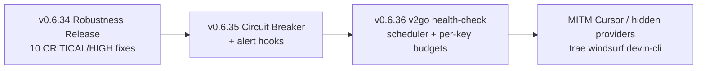

# Research Report: 9Router — Next Features & Full-Workflow Edge-Case Audit

**Date:** 2026-09-03
**Scope:** `vibecoder11200/9router` @ v0.6.33 (master, f8ea3e02) — fork of `decolua/9router` (upstream v0.5.59 merged)
**Question:** (1) What feature should we build next? (2) Edge cases / bugs across all workflows?

---

## Executive Summary

The fork's four own subsystems (proxy pools/rotation, v2go/Xray, DS2API, web-cookie + TOTU) are **well-designed but have systematic gaps at their edges**: the audit found **44 issues — 1 CRITICAL, 9 HIGH, 20 MEDIUM, 14 LOW** — concentrated in three clusters: (a) **`strictProxy` / rotation silently degrading to DIRECT connections** (IP leak — the one failure this feature must never make), (b) **Windows process-lifecycle leaks in the v2go/Xray subsystem** (wrong reaper directory, shutdown handler that exits before stopping xray, unlocked `switchConfig`), and (c) **regressions in the freshly merged upstream v0.5.59 code** (CommandCode peek drops same-chunk NDJSON events, /v1/search locks never clear on success, PXPIPE ignores the token-saver bypass header).

Security posture is unusually deliberate for a self-hosted gateway (no unauthenticated remote exploit found), but **one real logic flaw stands out**: the DB export/import route accepts any request with an `x-9r-cli-token` header *present* (never validated), letting any dashboard session dump every credential and import a settings blob that overwrites the password hash.

**Recommendation in one line:** before new features, ship a **v0.6.34 "robustness release"** fixing the 10 CRITICAL/HIGH items (they undermine flagship promises), then build — in order — **(1) notification/alert hooks, (2) a real circuit breaker with half-open probes (absorbs several lock-cascade bugs), (3) wire the already-shipped-but-unwired v2go health-check scheduler, (4) per-API-key budgets + cache-hit analytics**. Details in Part B.

---

## Research Methodology

- **Sources:** 4 parallel deep code audits (general-purpose agents, ~250 tool calls total, full-file reads) covering: proxy pool/rotation subsystem; xray/ds2api/totu managed subsystems; core request path (executor/fallback/streaming/token-savers/usage); auth/tunnel/security. Plus: `docs/project-roadmap.md`, `CHANGELOG.md` (v0.6.33 + v0.5.59 entries), `package.json`, upstream releases page (nothing newer than v0.5.59 found), fork GitHub issues (0 issues — no community signal).
- **Date range of materials:** changelog through 2026-09-01; audit performed 2026-09-03.
- **Key terms:** proxy rotation, strictProxy, cooldown, blue-green rotation, modelLock, account fallback, finalizeStream, CommandCode peek, SSRF guard, tunnel access, MITM root CA.
- **Caveat:** findings come from static reading, not reproduction. Each has file:line — verify locally before fixing. Severity = worst-case impact × plausibility.

---

## Part A — Edge-Case & Bug Audit (44 findings)

### A.1 Proxy Pools / Rotation (fork subsystem) — 12 findings

| # | Sev | Finding | Where |
|---|-----|---------|-------|
| P1 | **CRITICAL** | **strictProxy silently bypassed → DIRECT (server IP leak).** `strictProxy` is only enforced when a proxy URL *resolved* and the fetch threw. But resolution returns "no proxy" (→ direct, strictProxy never consulted) when: pool deactivated, group all-cooling-down, pool deleted/dangling, or entry has empty `proxyUrl`. Worst: the pool **test route itself deactivates pools on one failed test** (`isActive: result.ok`), so a transient blip permanently flips every bound connection to direct. For no-auth scraping (the feature's point = hide server IP) this leaks the origin IP to the providers most likely to ban it. | `src/lib/network/connectionProxy.js:101-151,216-223`, `open-sse/utils/proxyFetch.js:341-352`, `src/app/api/proxy-pools/[id]/test/route.js:113,161` |
| P2 | HIGH | **Lost-update race erases cooldowns.** Group-entry pick persists a stale `entries` snapshot read *before* the pick; `updateProxyPool` replaces `entries` wholesale. Concurrent 429-cooldown commits get wiped → next pick re-selects the rate-limited IP. Same stale-snapshot overwrite in the group test route. | `src/lib/network/connectionProxy.js:116-124`, `src/lib/db/repos/proxyPoolsRepo.js:102-113` |
| P3 | HIGH | **Pool deletion ignores no-auth provider bindings** (`settings.providerStrategies[providerId].proxyPoolId`) → dangling reference → silent direct fallback for OpenCode Free / mimo-free. | `src/app/api/proxy-pools/[id]/route.js:273-284`, `src/sse/services/auth.js:46-60` |
| P4 | MEDIUM | Group entries with empty `proxyUrl` are selectable and route DIRECT (proxyxoay seeds `proxyUrl:""` until first fetch). | `src/lib/network/proxyRotation.js:148-155` |
| P5 | MEDIUM | Undici dispatcher cache (max 20) evicts agents without `.close()`; double-creation race; socket/FD accumulation on long-running gateway. | `open-sse/utils/proxyFetch.js:216-237` |
| P6 | MEDIUM | Batch import: no dedup for group entries (duplicate exit IPs defeat per-IP cooldown); single-pool dedup key mismatch (`${url}|||` vs `${url}|||${noProxy}`). | `src/app/(dashboard)/dashboard/proxy-pools/page.js:597-607,644-668` |
| P7 | MEDIUM | Round-robin isn't round-robin: shared stale counter + pool list sorted by `updatedAt` which the pick itself bumps. | `src/lib/network/proxyRotation.js:175-179`, `proxyPoolsRepo.js:50` |
| P8 | MEDIUM | Managed-rotation single-flight has an await gap in the cooldown-bypass path → two concurrent `doRotate` → concurrent `switchConfig` (declared unsafe). | `src/lib/xray/managedRotation.js:366-393` |
| P9 | LOW | `_excludedProxyEntryIds` is dead code — per-request entry exclusion never plumbed; cooldown-persist failures swallowed by `.catch(()=>{})`. | `src/lib/network/connectionProxy.js:113-115` |
| P10 | LOW | proxyxoay `rotateKey` doesn't clear the entry's runtime `cooldownUntil` — fresh IP stays benched up to 60s (or 1h for IP-ban). | `src/lib/proxy/providers/proxyxoayManager.js:181-196` |
| P11 | LOW | `startForwardServer` null-derefs if pool row deleted mid-registration; fire-and-forget swallows it. | `proxyxoayManager.js:290` |
| P12 | LOW | `cooldownUntil` type contract mixes epoch-ms and ISO strings; client-supplied ISO via PUT → `Number(iso)=NaN` → cooldown silently never applies. | `proxyPoolsRepo.js:147-150` vs `[id]/route.js:21` |

### A.2 Managed Subsystems: v2go/Xray · DS2API · TOTU auto-fetch — 12 findings

| # | Sev | Finding | Where |
|---|-----|---------|-------|
| X1 | HIGH | **Windows reaper searches the wrong directory.** `getDefaultXrayDir()` assumes `~/.9router/xray` but real dir is `DATA_DIR/xray` (`%APPDATA%\9router` on Windows). Orphaned draining xray instances are **never cleaned on the fork's primary platform**; repeated crashes exhaust the switch port range (53108-53407). | `src/lib/xray/reaper.js:139-144` vs `src/lib/dataDir.js:7-12` |
| X2 | HIGH | **Empty/garbage subscription response wipes the catalog.** HTTP 200 + empty/HTML/block-page body → 0 links parsed → `markStaleXrayConfigs([])` deactivates **every** row; with `xrayStaleRetentionDays: 0` it immediately DELETEs the whole catalog. No minimum-count guard. | `src/lib/xray/sync.js:72-87`, `xrayRepo.js:178-183,213-223` |
| X3 | HIGH | **SIGINT/SIGTERM handler calls `process.exit()` before the dynamic `import()` of the xray stopper resolves** — "stop managed xray on shutdown" is dead code. Every Ctrl+C leaves the xray instance running detached. | `src/shared/services/initializeApp.js:61-71` |
| X4 | MEDIUM | `switchConfig` has no lock; three unserialized entry points (managed rotation, health-check auto-rotate, UI) → overlapping switches permanently leak an xray instance (untracked pid). | `src/lib/xray/manager.js:547-668` |
| X5 | MEDIUM | Xray binary install: no checksum verification (Xray publishes `.dgst`; the DS2API installer *does* verify sha256), no retry, extracts over the live binary → corrupt binary + stale `.version` = next start spawns garbage. | `src/lib/xray/installer.js:124-145,224-275` |
| X6 | MEDIUM | Auto-rotation retries the same dead candidate forever: picker takes first non-active row with no health filter; failed candidate's latency never downgraded (throw happens before `updateXrayTestResult`) → infinite loop on one dead node. | `src/lib/xray/manager.js:1386-1399` |
| X7 | MEDIUM | Stale PID file + PID reuse: no cmdline verification → "alreadyRunning" false positives and `stopXray`/`stopDS2API` can kill an innocent recycled process after reboot. | `src/lib/xray/process.js:84-93`, `src/lib/ds2api/process.js:35-43` |
| X8 | MEDIUM | **TOTU auto-fetch ignores configured interval after restart** — boot calls bare `startTotuAutoFetch()` (defaults 60min) instead of `configureTotuAutoFetch(settings)`; manual-only (interval 0) users get an unwanted hourly scheduler. | `src/shared/services/initializeApp.js:144-148` vs `src/lib/totuAutoFetch/index.js:216-224` |
| X9 | MEDIUM | Temp-probe (`.test-*`) and api-filter (`filter-api-*`) xray orphans escape reaping (POSIX pattern matches only `model-test-`; Windows skips process killing entirely). | `src/lib/xray/reaper.js:68-78`, `apiFilter.js:147,159-165` |
| X10 | LOW | TOTU OTP regex `\b([A-Za-z0-9]{6})\b` matches any 6-letter word ("Verify your…" → code="Verify") → registration fails, error swallowed as "flaky outage". | `src/lib/totuAutoFetch/mailtm.js:110-135` |
| X11 | LOW | api-filter readiness `waitForPort` can attach to a stale orphan's port; child failed to bind but readiness "succeeds" against the zombie. | `src/lib/xray/apiFilter.js:159-165,295-307` |
| X12 | LOW | TOTU `loginToken` plaintext in SQLite (grants account control beyond API); DS2API `credentials.json` `mode:0o600` is a no-op on Windows. | `totuAutoFetch/index.js:144-157`, `ds2api/process.js:54-65` |

### A.3 Core Request Path (executor · fallback · streaming · token savers · usage) — 10 findings

| # | Sev | Finding | Where |
|---|-----|---------|-------|
| C1 | HIGH | **CommandCode peek drops NDJSON events after the first sentinel in the same TCP chunk.** On hitting a sentinel it `break`s out of the line loop — every complete line after it in the same read is discarded. Providers routinely flush `start` + first `text-delta`s in one write → **silent prefix truncation**. Tests feed one line per chunk, so uncovered. *(Fresh v0.5.59-merge regression.)* | `open-sse/executors/commandcode.js:158-196` |
| C2 | HIGH | **`stripUnsupportedModalities` mutates the shared client body.** Replaces image blocks with text placeholders in-place on the caller's body → after a failed non-vision attempt, the vision fallback (capacity adapter or combo) receives only placeholders — the image is permanently lost on exactly the path built to handle it. | `open-sse/handlers/chatCore.js:158-168`, `translator/concerns/modality.js:61-93`, `src/sse/handlers/chat.js:165-180` |
| C3 | HIGH | **PXPIPE ignores `X-9Router-Token-Saver: off`.** Every other saver is gated on `tokenSaverEnabled`; pxpipe hard-codes `enabled:true`. The documented bypass doesn't work for the one saver that *changes content the model sees* (text→PNG). | `open-sse/handlers/chatCore.js:286-296` |
| C4 | MEDIUM | **Any unmatched error status (incl. deterministic 400/404/422) locks every account 30s.** `checkFallbackError` default `shouldFallback:true` → one malformed request cascades: each account fails identically → all locked → 503 until expiry. Also makes combo's `!shouldFallback` branch dead code. | `open-sse/services/accountFallback.js:48-49`, `src/sse/handlers/chat.js:513-523` |
| C5 | MEDIUM | **/v1/search success never clears `modelLock_websearch:*`.** Two layered bugs: `handleSearchCore` drops the `onRequestSuccess` callback (destructure misses it), and even if called, `clearAccountError` without `model` never clears the scoped key. Search stays locked for the full cooldown after success; account-wide `testStatus:"unavailable"` stamped from a search-only failure. | `open-sse/handlers/search/index.js:155`, `src/sse/handlers/search.js:212-215`, `src/sse/services/auth.js:315-320` |
| C6 | MEDIUM | **Combo alias cycles → unbounded recursion** (combo referencing itself or a→b→a) → stack grows to `RangeError` 500. No cycle validation on combo create. | `src/sse/handlers/chat.js:196-242`, `src/app/api/combos/route.js:41` |
| C7 | MEDIUM | **Usage lost on OpenAI-passthrough `[DONE]`-then-disconnect.** Upstream's fix covered Responses terminals only; passthrough forwards `[DONE]` without calling `finalizeStream()` — eager clients that cancel the reader on `[DONE]` abort the transform, `flush` never runs, usage never recorded. | `open-sse/utils/stream.js:139,227-238,376-407` |
| C8 | LOW | CommandCode peek error-path returns `originalResponse` with a half-consumed body → corrupt SSE prefix downstream. | `commandcode.js:200-203` |
| C9 | LOW | Passthrough flush emits a **duplicate `data: [DONE]`** (`streamDoneSent` only set in translate mode). | `stream.js:400-404` |
| C10 | LOW | chatSearch clears its abort timer on headers, then reads body with no signal → stalled upstream hangs /v1/search far past timeouts. | `open-sse/handlers/search/chatSearch.js:501-513` |

**Verified clean:** fallback loop bounds (account exclusion + `MAX_MANAGED_CONN_RETRIES=2`); no fallback after stream start; no duplicate usage on retry; `finalizeStream` once-guard; NDJSON trailing-line parse; usage parsing NaN-guards; no unbounded memory in rotation state.

### A.4 Security (auth · tunnel · MITM · SSRF · secrets) — 10 findings

| # | Sev | Finding | Where |
|---|-----|---------|-------|
| S1 | HIGH | **DB export/import auth bypass via dummy CLI header.** Route guard admits JWT *or* CLI token, but `isCliRequest()` only checks the `x-9r-cli-token` header is **present**, never valid. Any dashboard session (incl. over tunnel — route not in LOCAL_ONLY) adds `x-9r-cli-token: x` → skips password re-auth → `exportDb()` returns every OAuth token/API key/raw settings; `importDb` writes settings wholesale, bypassing `PROTECTED_SETTING_KEYS` (can overwrite the bcrypt hash → persistent access without knowing the password). | `src/app/api/settings/database/route.js:9-16`, `src/dashboardGuard.js:41-48,292-296`, `src/lib/db/index.js:90-134` |
| S2 | MEDIUM | **SSRF guard defeated by redirects + DNS + missing CGNAT range.** `assertPublicUrl` string-matches the hostname only; `fetch()` follows redirects → `providerOptions.baseUrl=https://attacker.com/r` → 302 → `http://169.254.169.254/` / `localhost:8787` returned as search results. Public DNS A-record in private range works too; `100.64.0.0/10` (Tailscale) not blocked. API-key-reachable via `/v1/search`. | `src/shared/utils/ssrfGuard.js:48-56`, `open-sse/handlers/search/callers.js:71-92` |
| S3 | MEDIUM | `ENABLE_REQUEST_LOGS=true` writes full Authorization/cookie headers **and upstream OAuth bearer tokens** to `logs/` in plaintext (masking explicitly disabled). | `open-sse/utils/requestLogger.js:72-91,130-164` |
| S4 | MEDIUM | MITM root CA private key written with default umask (world-readable on Linux) → anyone reading it can mint certs for any domain for 10 years once the user trusts the CA. JWT secret, by contrast, is correctly `0o600`. | `src/mitm/cert/rootCA.js:88-90` |
| S5 | MEDIUM | Cached sudo password: AES-GCM key derived only from public `machineIdSync()` + hardcoded salt; ciphertext returned by `GET /api/settings` (only `password`/`oidcClientSecret` stripped) and present in DB exports → offline decryption with any DB copy. | `src/mitm/manager.js:97-98,154-171`, `src/app/api/settings/route.js:21` |
| S6 | MEDIUM | `tunnelDashboardAccess` defaults **true** → one dashboard password unlocks remote process-spawning routes over the tunnel (ds2api/xray install/start, Headroom, MITM, `/api/version/update`); on plain-HTTP external tunnels the `auth_token` cookie crosses without `Secure`. | `src/dashboardGuard.js:104-112,236-244`, `settingsRepo.js:32` |
| S7 | LOW | All OAuth refresh tokens / API keys / TOTU loginToken plaintext in SQLite; API keys looked up `WHERE key = ?` (not hashed at rest). | `connectionsRepo.js`, `apiKeysRepo.js:41-44` |
| S8 | LOW | Unauthenticated `GET /api/settings/require-login` returns tunnel hostnames → Host-spoof converts "tunnel-only" checks into "knows-a-hostname" checks. | `src/app/api/settings/require-login/route.js:4-12`, `tunnelAccess.js:16-28` |
| S9 | LOW | `API_KEY_SECRET` defaults to a hardcoded public literal (forgeable CRC); `.env.example` documents `REQUIRE_API_KEY` env that no code reads (actual toggle is DB setting `requireApiKey`, default true). | `src/shared/utils/apiKey.js:3-18`, `.env.example:14,19` |
| S10 | LOW | Cloudflared tunnel token passed in argv (`--token` in `ps`/`/proc` output). | `src/lib/tunnel/cloudflared/cloudflared.js:195-198` |

**Verified not vulnerable:** JWT handling (HS256, exp enforced, per-install secret 0600, httpOnly+SameSite=Lax); default-password remote login refused until rotated; `custom-server.js` header sanitization + unforgeable peer token; path traversal closed; MCP bridge preset-plugins-only; `/v1` key-gated even when `requireApiKey=false`.

---

## Part B — What to Build Next (ranked)

### Recommendation overview

### B.0 First: v0.6.34 "Robustness" — fix before feature

The 10 CRITICAL/HIGH findings each directly undermine a flagship promise (IP hiding, zero-downtime rotation, fallback correctness, credential safety). Cheap, high-leverage, and they restore trust in the subsystems everything else builds on:

1. **P1** strictProxy: never degrade-to-direct; never auto-deactivate on a failed test. *(Guard: if `strictProxy && no usable entry` → fail the request.)*
2. **X1+X3** Windows reaper dir + awaited shutdown stop. *(2-line and 5-line fixes.)*
3. **S1** validate CLI token in `/api/settings/database`; strip `password`/`mitmSudoEncrypted` on import.
4. **C1** CommandCode peek: on sentinel, keep remaining lines as replay prefix (don't `break`).
5. **C2** deep-clone/restore body before `stripUnsupportedModalities` per attempt.
6. **C3** PXPIPE gate on `tokenSaverEnabled`.
7. **P2/P3** transactional `stampEntryUsed` delta-write; DELETE checks `providerStrategies` bindings.
8. **X2** abort sync when previous catalog non-empty and fresh parse = 0.
9. **P8/X4** synchronous single-flight flag + promise-chain mutex on `switchConfig`.

### B.1 Feature 1 — Alert & notification hooks 🥇

**What:** webhook/Telegram/Discord notifications for: all-accounts-locked on a provider, combo fully exhausted, proxy pool exhausted / strictProxy tripped, xray active node dead + rotation failed, DS2API/TOTU sidecar failures, quota ≈ exhausted (uses existing per-account usage bars), "cost this week" digest.
**Why first:** The pitch is "never stop coding" — today the user only discovers failure when their CLI errors mid-task. Every audit cluster produces exactly the events worth alerting on. No new core state needed — all signals already exist (modelLock writes, rotation exhaustion, health-check failures). Moderate effort, very high perceived value.
**Where it plugs in:** `markAccountUnavailable` / modelLock writes, `resolveConnectionProxyConfig` exhaustion path, xray `runHealthCheck` failure branch, TOTU scheduler error path.

### B.2 Feature 2 — Real circuit breaker (half-open probing) 🥈

**What:** Replace/augment per-error `modelLock_<model>` 30s stamps with a proper breaker per (provider, account, model): closed → open after N failures in window → half-open probe with a cheap canary request → close/keep-open. Dashboard visualization of breaker states.
**Why:** Solves *four* audit findings as a side effect (C4 lock-cascade on deterministic 400s, C5 search lock-never-clears, the 30s all-accounts-503 cascade, blind retry after transient blips) while being the single most-requested reliability feature in this product category (OmniRoute — the other major fork — advertises one). Bigger effort; schedule after alerts.

### B.3 Feature 3 — Wire the v2go health-check scheduler 🥉 (cheapest win)

`xrayHealthCheckIntervalMin` is an existing dashboard setting that currently maps to nothing (manual/API-triggered only — explicitly listed in `docs/project-roadmap.md` §2.3). The health-check code already exists (`runHealthCheck`). This is a wiring job: boot-time `setInterval` + settings-change re-arm, plus auto-rotate fixes from **X6** (advance past dead candidates). Small effort, closes a roadmap TODO, and makes auto-rotation actually automatic.

### B.4 Feature 4 — Per-API-key budgets & cache-hit analytics

Builds directly on v0.6.28 (per-key usage rows) and v0.5.59 (nested `cached_tokens`): soft spend caps / token caps per API key with alert-at-80% (rides Feature 1), plus a cache-hit-rate panel per provider/model — makes the "savings tracker" story measurable ("RTK saved X%, prompt cache saved Y%"). Medium effort, differentiates the dashboard.

### B.5 Later / explicitly considered and deprioritized

- **MITM Cursor completion** (roadmap §2.3) — closes the last IDE gap; good but niche vs. the above.
- **Hidden providers unblock** (trae/windsurf/devin-cli tool-calling) — depends on upstream translator progress.
- **Semantic response cache** (OmniRoute has one) — YAGNI for a coding gateway: exact-prefix prompt caching already happens upstream; semantic cache risks stale answers in agentic loops. Skip unless users ask.
- **LLM evaluations** — different product. Skip.
- **DS2API loopback-only binding** (roadmap §2.3) — small, fold into v0.6.35 as a hardening item.

### B.6 Quality infrastructure (do alongside B.0)

1. **Chunk-boundary fuzz tests for stream parsers** — C1/C7/C9 all live at "event split across/between chunks" boundaries where tests feed one line per chunk. A property test feeding random chunk splits would have caught all three.
2. **Windows process-lifecycle CI** — X1/X3/X9 are Windows-only and CI-invisible. A GitHub Actions windows-latest job that boots the server, starts xray, SIGINTs, and asserts no orphan `xray.exe` remains would lock the whole class.

---

## Comparative Analysis (fork vs. ecosystem)

| Capability | 9router fork (v0.6.33) | Upstream decolua (v0.5.59) | OmniRoute fork |
|---|---|---|---|
| Provider count | 124 defs (~40 executors) | ~118 | 36+ (TS rewrite) |
| Managed egress proxy (v2go/Xray) | ✅ unique | ❌ | ❌ |
| Web-cookie providers (Gemini/Genspark/DS2API) | ✅ unique | ❌ | ❌ |
| Account farming (TOTU) | ✅ unique | ❌ | ❌ |
| Circuit breaker | ❌ (modelLock primitive) | ❌ | ✅ |
| Semantic cache | ❌ | ❌ | ✅ |
| Alerting/notifications | ❌ | ❌ | ❌ |
| Tests | 2,442 (per v0.6.33 changelog) | shared | 368+ |
| Distribution | GitHub Releases + Docker | npm + Docker | npm + Docker |

Alerting is table-stakes *nobody* in this niche has — cheapest differentiation. Circuit breaker is the reliability feature the one comparable fork already advertises.

---

## Common Pitfalls (patterns behind the findings)

1. **Shared mutable documents + read-modify-write** (pool `entries`, `rrCounter`) — fix with transactional delta-writes (`markProxyEntryCooldown` is the in-repo correct pattern to copy).
2. **Fail-open where fail-closed is required** — strictProxy/direct fallbacks, empty-catalog sync. When the feature's contract is "never leak / never wipe", the default on anomaly must be *stop*, not *continue without*.
3. **Async cleanup racing `process.exit()`** — every shutdown handler must `await` (bounded) before exit.
4. **`break`-ing out of a line loop inside a chunk** — stream parsers must treat "lines after the sentinel in the same buffer" as replayable state.
5. **In-place mutation of shared request bodies** — snapshot/restore per fallback attempt; mutation is only safe on the per-attempt translated copy.
6. **Header-presence checks instead of validation** — `Boolean(header)` is not auth.

## Unresolved Questions

1. P1 fix semantics: on strictProxy + exhausted group, should the request fail immediately, or should it fall through to the next *account/combo tier* (current graceful path) while never going direct? (Recommend: fail on same account only after trying proxy entries, then fall through tiers — but never direct.)
2. Does upstream have a pending fix for C1 (CommandCode peek) worth cherry-picking instead of patching locally (merge-conflict cost vs. shared fix)?
3. Alert delivery channels for Feature 1: webhook-only (KISS) vs. native Telegram/Discord integrations from day one?
4. Should `tunnelDashboardAccess` default flip to `false` (S6) — a breaking change for existing tunnel users who rely on it?

## Appendices

- **A. Glossary:** modelLock = per-model failure lock keyed on account; strictProxy = pool flag "fail rather than leak real IP"; blue-green = start new xray, verify, repoint, drain old; capacity adapter = auto-fallback pool for vision/audio to a capable model; DS2API = managed Go sidecar for DeepSeek Web.
- **B. Raw audit outputs:** the four agent reports (proxy rotation; xray/ds2api/totu; core path; security) are reproduced in Part A tables with original file:line references.
- **C. Verification status:** all findings are static-read, file:line-anchored (audit date 2026-09-03, master f8ea3e02). None have been reproduced at runtime — verify before fixing; per AGENTS.md, run GitNexus `impact()` before editing any listed symbol and `detect_changes()` before committing.

---

# Part D — Red-Team Verification (2026-09-04)

Every finding was adversarially re-verified against source by four independent verifier agents (read cited code + callers + guards).

## Verdict summary

| Area | Confirmed | Partial | Refuted |
|---|---|---|---|
| Proxy rotation (P1-P12) | 11 | 1 (P12) | 0 |
| Managed subsystems (X1-X12) | 12 | 0 | 0 |
| Core path (C1-C10) | 9 | 1 (C2) | 0 |
| Security (S1-S10) | 9 | 1 (S3) | 0 |
| **Total** | **41** | **4** | **0** |

## Partials (what's actually true)

- **P12 → PARTIAL:** every in-repo writer stores epoch-ms; the ISO-string risk only materializes if an *external* client PUTs a string `cooldownUntil`. The audit misattributed `lastUsedAt`'s ISO format to the cooldown chain. Defensive normalization still worth it.
- **C2 → PARTIAL:** the in-place mutation is real and confirmed, but the headline scenario was inverted — the capacity adapter *prepends* vision-capable models and combo `autoSwitch` floats vision members first, so the vision attempt normally runs before any strip. Real manifestations: **combo fusion** (panel members + judge share nested message objects) and **history-media requests** (images in older turns trigger no reorder).
- **S3 → PARTIAL:** masking is a genuine no-op, but the whole logger is gated behind `ENABLE_REQUEST_LOGS=true` (default false) — plaintext tokens only in opt-in deployments. Severity LOW-MEDIUM in practice; fix is trivial (re-enable masking).
- **(S1 remains fully CONFIRMED — all four halves verified; requires a valid JWT session, but defeats the password re-auth barrier and can rewrite the password hash via import.)**

## 12 NEW issues found during verification

1. `test/route.js:56-76` — group-test branch has **no v2go exemption** and its "no entries to test" path sets `isActive:false` → deactivates whole pool → silent direct (compounds P1/P4).
2. `test/route.js:92-114` — group test writes stale-snapshot `updatedEntries` (same lost-update family as P2).
3. `connectionProxy.js:224-242` — thrown DB error returns `source:"error", strictProxy:false` → strict pool routes direct on transient DB failure (P1 family).
4. `reaper.js:119-123` — Windows draining-kill branch lacks the cmdline verification the POSIX branch has → PID reuse can kill innocent process at boot.
5. Legacy `~/.9router` hardcodes in `reaper.js:27`, `apiFilter.js:35,146-147`, `managedRotation.js:92-94` → Windows writes logs/configs to a tree disjoint from DATA_DIR (X1 family).
6. `totuAutoFetch/index.js:218,235` — `|| 60` coercion means **interval 0 is impossible**: no manual-only mode exists despite settings-route comment claiming it stops the timer.
7. `streamingHandler.js:47-53` — `onRequestSuccess` fires the moment a 200 SSE response *starts* (before any byte streams) → upstream dying at first byte still "heals" the account/modelLock.
8. `commandcode.js:134-199` — no bound on pre-sentinel buffering: renamed/unknown event types buffer the entire response in RAM (no streaming, unbounded memory).
9. `commandcode.js:312-318` — wrapped SSE Response spreads all original headers (stale `content-length`/`content-encoding` can mis-frame the re-encoded stream).
10. `mitm/manager.js:159-161` — `deriveKey()` catch-fallback = sha256(salt alone): if `node-machine-id` fails to load, every install's sudo-password key is the same public constant.
11. `dashboardSession.js:75-82` — `verifyDashboardPassword`'s `INITIAL_PASSWORD || "123456"` fallback lacks the locality gate the login route has; combined with S1(d) import, a stolen session can reset re-auth to a known value remotely.
12. `settings/database/route.js:20` — credential-dump GET lacks `Cache-Control: no-store` (unlike `/api/settings`) → intermediary caches could retain the dump.

## Feature design research (2026-09-04, 4 web searches)

- **Budgets (LiteLLM reference):** virtual-key model with `max_budget` (hard block) + `soft_budget` (alert threshold) + `budget_duration` (window reset); spend persisted per key; webhook fired on threshold crossing. Known LiteLLM bugs to avoid: budget webhook stops firing after first trigger (#16185) → threshold crossing must be edge-triggered and re-arm each window; stale-spend race at enforcement (#27735) → read fresh spend inside the enforcement check.
- **Alert channels:** Discord webhook ≈30 msg/min per webhook, 5 req/5s per channel, 10 embeds/6000 chars per message, honor 429 `Retry-After`; Telegram 30 msg/s global, 20 msg/min per group, 1 msg/s per chat, 429 carries `retry_after` → needs a client-side send queue + dedup/coalescing window.
- **Circuit breaker (Azure/Portkey/Zuplo canonical):** closed → N failures in window → open (fail fast) → cooldown → half-open (admit exactly ONE trial request; success closes, failure re-opens with longer cooldown). For LLM gateways the probe is usually the next *real* request, not a synthetic canary (avoids paying tokens for health checks and probes the exact failing path). The recovering provider must not be flooded — half-open admits 1, not all.
- **v2go scheduler:** no external research needed — wiring exists (`runHealthCheck` + `xrayHealthCheckIntervalMin` setting), pure integration + X6 candidate-advance fix.
