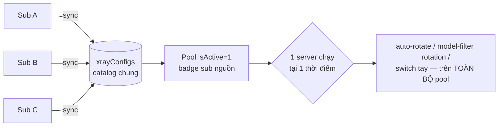

# Research — /dashboard/xray: Thêm nhiều Subscriptions thì xray có dùng server của tất cả sub không?

- **Ngày:** 2026-09-28
- **Câu hỏi:** Khi thêm nhiều Subscriptions ở `/dashboard/xray`, service xray có sử dụng server từ **tất cả** các sub hay chỉ dùng sub **đầu tiên** được thêm?
- **Phương pháp:** Đọc toàn bộ chuỗi sync → catalog → runtime selection (sync.js, xrayRepo.js, subscriptionRepo.js, manager.js, managedRotation.js, các API routes, UI page.js/SubscriptionManager.jsx).

## Kết luận

**Xray dùng server từ TẤT CẢ các subscription đang enabled — không chỉ sub đầu tiên.** Không tồn tại bất kỳ logic nào lọc server theo subscription trong toàn bộ luồng runtime. Cần lưu ý một nuance thiết kế: tại mỗi thời điểm **chỉ MỘT server được chạy** (single-outbound), các server của mọi sub hợp thành **pool ứng viên** cho việc chọn/rotate.

## Bằng chứng theo từng lớp

### 1. Sync engine — sync tất cả sub enabled

`syncSubscription()` (`src/lib/xray/sync.js:248-294`) khi không truyền `subscriptionId` sẽ lặp qua `listXraySubscriptions({ enabled: true })` và sync **tuần tự tất cả**. Sub lỗi không chặn sub còn lại (try/catch per-sub, lỗi ghi vào row của sub đó).

### 2. Catalog dùng chung — mọi sub đổ vào một bảng `xrayConfigs`

- Link từ mọi sub được upsert vào chung `xrayConfigs` với `isActive=1` (`bulkUpsertXrayConfigs`, `xrayRepo.js:150-181`).
- Quan hệ many-to-many qua bảng `xrayConfigSubscriptions` (membership per-sub). Cùng một link xuất hiện ở 2 sub → **1 row config, 2 membership** (id = sha1 canonical link) — không trùng lặp.
- **Cross-sub isolation** (`syncOneSubscription`, sync.js:119-236): sync sub X chỉ deactive config khi nó mất membership **cuối cùng** (`getConfigIdsWithNoMembership`). Sub khác còn giữ server đó thì server vẫn active. Đây chính là fix cho "sub cuối thắng" của mô hình 1-URL cũ.
- Server list trong UI gắn badge tên sub nguồn (`getConfigSubscriptionNames`, `xrayRepo.js:329-343`; API `/api/xray/configs` gắn `c.subs`).

### 3. Runtime — chọn/rotate server trên toàn catalog, không lọc sub

| Đường | Nguồn pool | Vị trí |
|---|---|---|
| Start service | selected → healthiest active → `getXrayConfigs({isActive:true})[0]` | `manager.js:440-451` |
| Auto-rotate khi health fail | `getXrayConfigs({ isActive: true, healthyOnly: false })`, thử tối đa 5 ứng viên | `manager.js:1433-1445` |
| Model filter | `getXrayConfigs({ isActive: true })` | `manager.js:1043` |
| Rotation theo lỗi 429/5xx | ứng viên từ `modelFilterResults` (key theo configId, sub-agnostic) | `managedRotation.js:263` |
| Switch tay | mọi `configId` hợp lệ | `/api/xray/switch` |

Không có chỗ nào tham chiếu `subscriptionId` khi chọn server. "Sub đầu tiên" duy nhất trong hệ thống là sub tên "Default" do migration legacy một-lần tạo ra (`migrateLegacySubscription`, `subscriptionRepo.js:257-297`) — nó chỉ là **một nguồn sync bình thường**, không đặc quyền gì hơn các sub sau đó.

### 4. Thêm sub mới — server vào pool tự động sau ~5 giây

POST `/api/xray/subscriptions` tạo row (enabled mặc định true) rồi gọi `startSyncScheduler()` (`subscriptions/route.js:74-75`). Boot timer 5s → `fireDueSyncs()` → sub chưa từng sync được coi là **due ngay** (`if (!sub.lastSyncAt) return true`, sync.js:415) → sub mới tự được fetch, server của nó vào catalog mà không cần thao tác gì thêm. Sau đó auto-rotate / model-filter / switch tay đều thấy được chúng.

## Caveats (đúng thiết kế, không phải bug "chỉ sub đầu")

1. **Single-outbound:** service xray chỉ chạy 1 server tại một thời điểm; đổi server = rewrite config.json + blue-green restart (`managedRotation.js:1-10` comment). Đa sub tăng độ rộng pool ứng viên, không phải chạy song song nhiều server.
2. **Auto-rotate giới hạn 5 ứng viên** (`MAX_ROTATE_ATTEMPTS=5`, manager.js:1432-1434) theo sort mặc định (latency asc, server chưa test xuống cuối) — không phân biệt sub nhưng server chưa đo latency sẽ không được ưu tiên thử.
3. **Sub với interval = 0 (manual-only)** không tự sync khi vừa thêm (`fireDueSyncs` bỏ qua interval ≤ 0 kể cả khi chưa từng sync, sync.js:412-417) — phải bấm "Sync Now"/"Sync All". Mặc định khi thêm qua UI không truyền interval = kế thừa global default (60 phút) nên trường hợp này chỉ xảy ra nếu user chủ động đặt 0.
4. **Sub disabled**: server đã sync vẫn ở lại catalog (chỉ bị deactive khi mất membership cuối cùng — ví dụ khi xóa sub, áp retention của sub đó: 0 = xóa ngay, N ngày, -1 = giữ mãi).

## Bổ sung (cùng ngày): Số lượng server hiển thị ở Model Proxy Filter

**Pool được xét: đúng toàn bộ sub — nhưng số "tested/passed" hiển thị mặc định KHÔNG phải toàn bộ server của mọi sub.**

- Pool: `filterConfigsByModel` lấy `getXrayConfigs({ isActive: true })` — toàn bộ catalog active của mọi sub (`manager.js:1043`), không lọc sub.
- Slice: `selected = normalized.all ? configs : configs.slice(0, normalized.limit)` (`manager.js:1050-1051`). `normalizeModelFilterLimit` mặc định **50**, clamp 1..500 (`manager.js:941-944`).
- Thứ tự slice theo sort mặc định của `getXrayConfigs` (`xrayRepo.js:59-64`): selected trước → latency asc → **server chưa test (latency null) xếp cuối cùng**.
- UI hiển thị `passed/tested usable` của đúng tập đã test (`page.js:1085-1086`), plus badge cache tổng (`page.js:1092-1100`).

**Hệ quả thực tế (dễ gây hiểu nhầm "sub mới không được tính"):** server của sub mới thêm chưa có `lastLatencyMs` nên sort xuống cuối dãy; với limit 50 và catalog lớn, chúng hầu như không bao giờ lọt vào tập tested — dù nằm trong pool. Chúng chỉ được test khi: bật **"Test all active"** (`xrayModelFilterAll`), tăng limit (≤500; catalog >500 server thì bắt buộc dùng all), hoặc chúng đã có latency từ lần chạy trước (spawn-mode probe ghi ngược latency vào `xrayConfigs` qua `updateXrayTestResult`, `manager.js:928`; **api-mode thì không** — chỉ ghi cache model-filter, `apiFilter.js` không gọi `updateXrayTestResult`).

Badge per-server trong bảng server ("Passed Xh ago / Failed / Untested") thì hiển thị cho **mọi** server của mọi sub (dữ liệu từ cache keyed theo configId, gắn tại `/api/xray/configs`) — nhưng đó là kết quả cache, không phải cam kết tất cả đã được test.

## Bổ sung 2 (cùng ngày): Auto-filter sau sync — đợi tất cả sub hay check từng sub?

- **Batch (Sync All, hoặc scheduled tick có nhiều sub due):** `syncSubscription`/`fireDueSyncs` sync tuần tự TẤT CẢ sub trong run **xong hết** rồi mới gọi `maybeRunModelFilterAfterSync` **một lần duy nhất** trên catalog đã gộp (`sync.js:275-285`, `sync.js:419-431`). Không có chuyện "sub nào sync xong check sub đó trước" trong batch.
- **Per-sub (nút Sync Now trên 1 sub, hoặc tick chỉ có 1 sub due):** nhánh `subscriptionId` cũng gọi auto-filter ngay sau sub đó (`sync.js:263-264`) → filter chạy sau từng lần sync đơn lẻ.
- **Fire-and-forget:** `maybeRunModelFilterAfterSync` không await filter — trả `{queued: true}` ngay, filter chạy nền (`sync.js:311-320`).
- **Trùng lặp thì SKIP, không xếp hàng:** `runModelFilterJob` single-flight qua `modelFilterRunning`; trigger thứ hai khi filter đang chạy → `{skipped: true, reason: "already_running"}` (`manager.js:1287-1290`). Ví dụ: filter từ sub A đang chạy, user bấm Sync Now sub B → filter cho B bị bỏ qua, server mới của B chỉ được test ở lần trigger sau.
- **Tập test của auto-filter** theo settings đã lưu: `xrayModelFilterLimit` (default 50) hoặc `xrayModelFilterAll` (`runModelFilterFromSettings`, `manager.js:1373-1389`) — kết nối với mục Bổ sung 1 về top-N slice.

## Đánh giá thiết kế (cùng ngày)

**Verdict: đúng pattern cho single-sub; với multi-sub có 2 lỗ hổng thật sự.**

Ổn: coalesce filter sau batch (1 lần thay vì N lần — filter đắt tiền); fire-and-forget không block API sync; single-flight chống 2 filter chồng nhau (sẽ phá filter-xray/state); lỗi filter không ảnh hưởng sync; cache TTL tránh re-probe.

Chưa ổn:
1. **Skip-on-conflict không có hàng đợi/re-run** (`manager.js:1288-1290`): sync hoàn tất trong lúc filter chạy → trigger bị bỏ qua im lặng, chỉ log console. Tự lành ở scheduled-sync kế tiếp (default 60 phút) nhưng với "Sync Now" trong window filter dài (catalog lớn + test all) thì sub vừa sync không được validate.
2. **Top-N starvation (nghiêm trọng nhất):** slice theo sort latency (`manager.js:1051` + `xrayRepo.js:59-64`) tự củng cố — các slot top-N bị chiếm bởi server đã có latency, server sub mới (latency null) không bao giờ vào. Hệ quả dây chuyền: rotation candidates lấy từ model-filter results (`managedRotation.js:42`) và health-auto-rotate cần latency (`manager.js:1433`) → **server chưa test là vô hình với cả 2 đường rotation**. Thêm sub mới mà không bật "Test all" thì server của sub đó hầu như không bao giờ được dùng.
3. Minor: skip không hiện trên UI (chỉ console); api-mode không ghi latency ngược `xrayConfigs` (`apiFilter.js` không gọi `updateXrayTestResult`) làm sort kém chính xác.

Hướng khắc phục (nếu làm): (a) dirty-flag — filter xong kiểm tra có sync hoàn tất trong lúc chạy thì re-run 1 nhịp; (b) slice ưu tiên server chưa test trước rồi mới top-up theo latency; (c) sync-first-time của một sub → chạy filter all cho sub đó; (d) surface skip reason lên UI. Giải pháp tạm không cần code: bật `xrayModelFilterAll` khi catalog lớn.

Không có câu hỏi mở đối với phạm vi câu hỏi này. (Nếu muốn, có thể cân nhắc: filter/sort server list theo sub nguồn trong UI — hiện chỉ có badge, chưa có filter.)
